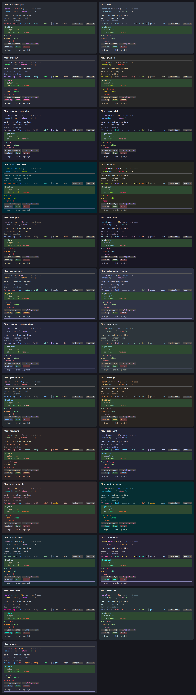

# pi-flow-themes — 25 套官方配色的 pi 主题

为 [pi coding agent](https://github.com/earendil-works/pi) 移植的 25 套知名配色。
色值全部取自各主题的官方调色板（来源与上游 commit 锁定在 `sources/theme-sources.json`），每个 token 的角色
按原作者的高亮规范逐一手工映射，主题 JSON 由 `build_themes.py` 从这份映射表生成，25 套都经 pi 0.85.1
（`@earendil-works/pi-coding-agent`）自带的 schema 校验器与加载器实际加载通过。



> English documentation: [README.en.md](README.en.md)。下文各深入文档均有英文版，链接见各节。

| 主题 | 依据 |
|---|---|
| `flow-one-dark-pro` | Binaryify/OneDark-Pro tokenColors、joshdick/onedark.vim |
| `flow-nord` | nordtheme.com 文档、nordtheme/vim（注释用官方的 nord3 brightened `#616E88`） |
| `flow-dracula` | spec.draculatheme.com、dracula/vim |
| `flow-gruvbox` | morhetz/gruvbox（dark medium） |
| `flow-catppuccin-mocha` | catppuccin style-guide、catppuccin/nvim |
| `flow-tokyo-night` | folke/tokyonight.nvim（night） |
| `flow-solarized-dark` | altercation/vim-colors-solarized |
| `flow-monokai` | 原版 Monokai（VS Code 内置 Monokai 的色值） |
| `flow-kanagawa` | rebelot/kanagawa.nvim（wave） |
| `flow-rose-pine` | rose-pine/neovim（main） |
| `flow-ayu-mirage` | ayu-theme/ayu-colors（官方生成器解析 mirage.yaml 的结果） |
| `flow-catppuccin-frappe` / `flow-catppuccin-macchiato` | catppuccin/palette、catppuccin/nvim |
| `flow-everforest` | sainnhe/everforest（dark medium） |
| `flow-github-dark` | primer/github-vscode-theme（classic dark，暗色 = 浅色标尺反转） |
| `flow-melange` | savq/melange-nvim（dark） |
| `flow-miramare` | franbach/miramare |
| `flow-moonlight` | atomiks/moonlight-vscode-theme（colors.ts + 主题 JSON） |
| `flow-noctis-bordo` / `flow-noctis-sereno` | liviuschera/noctis（bordo / sereno 主题 JSON + UI 色） |
| `flow-oceanic-next` | voronianski/oceanic-next-color-scheme（tmTheme + 官方扩展调色板） |
| `flow-synthwave84` | robb0wen/synthwave-vscode |
| `flow-andromeda` | EliverLara/Andromeda（官方 VS Code 主题） |
| `flow-material` | tinted-theming/schemes base16/material + Base16 角色规范 |
| `flow-snazzy` | tinted-theming/schemes base16/snazzy + Base16 角色规范 |

## 安装

```bash
mkdir -p ~/.pi/agent/themes && cp themes/flow-*.json ~/.pi/agent/themes/
pi --use-theme flow-dracula      # 本次运行使用；交互内 /settings 可选择并保存
pi --use-theme light/flow-nord   # 跟随终端明暗：浅色终端用内置 light，深色用 flow-nord
```

编辑 JSON 后 pi 会热重载。

工具状态盒等 UI 面是真彩色的低饱和深色，需要终端链路（pi → tmux → 终端）全程 24 位色：
若状态盒发青 / 发灰，按 [docs/truecolor.md](docs/truecolor.md) 排障
（English: [truecolor.en.md](docs/truecolor.en.md)）。

## 设计原则：背景承载状态，前景承载个性

pi 没有全局背景 token，画布就是终端自己的背景色，主题只能决定画在其上的东西。本集把 56 个 token 分成两层：

- **UI 层（19 个 token，25 套共用一组常量）**——用户消息盒、三种工具状态盒、选中、搜索、分隔线、
  滚动条、thinking 七档边框，只用一组低饱和深色：背景只表达状态、不表达主题身份。面板钉在 L\* 27.5，
  在 L\* 0–22 的主流终端默认底色上都能分辨。
- **前景层（37 个 token）**——正文 / 次要 / 状态行、语法、markdown、状态色、accent、边框，原则上
  只取各官方调色板的色值，角色按原作者的高亮规范映射；正文在各自画布上全部 ≥ 4.5:1。

三种度量（对比度 / CIE L\* / ΔE）的定义、UI 层常量表与各终端底色实测、每套主题可用的最亮底色、
坚持官方色的已知代价（`--check` 会列出，有意不修）与有意的角色偏离清单，见
**[docs/design.md](docs/design.md)**（English: [design.en.md](docs/design.en.md)）；
所有数字都能用 `python3 build_themes.py --measure` 重新算出。

## 构建

`themes/` 已是成品。要改配色或加主题，只需要改一个文件：

```bash
python3 build_themes.py            # 由 THEMES 表重新生成 themes/
python3 build_themes.py --check    # 对比度按 FLOOR 把关（非白名单的低对比项失败）+ 每套的画布支持上限
                                   #   + sources/theme-sources.json 完整性 + 近重复主题报告；任一不过 exit 1
python3 build_themes.py --preview  # 附带两张效果图（需 playwright CLI + chromium）
python3 build_themes.py --measure  # 输出 README 引用的全部度量：UI 层 L*、状态盒两两 ΔE、面板对各终端底色的 ΔL*、逐主题对比度表
python3 build_themes.py --measure '#2E4931' '#414141'   # 任意几个色值：各自 L*a*b*，两两对比度 / ΔE / ΔL*
```

加一套主题就是在 `THEMES` 里加一个条目：官方调色板的 hex 与角色表。正文 / 次要 / 状态行、accent、边框、
三个状态色、标题 / 代码 / 标签和九个语法角色必须写全，其余 token 按 `DEFAULTS` 落到 text / muted / dim / accent 等；再在 `sources/theme-sources.json` 加一条来源（上游仓库、完整 commit、
文件、许可证），否则 `--check` 不过。

全部复核——两次构建 sha1 一致、`themes/` 与 `THEMES` 同步、`--check` 把关、pi 校验器 + 加载器实测
25 套——收敛为一个自包含脚本 `ci/check.sh`（约 8 秒）。git hooks / cron / 自托管 forge 的接入方式，
以及用 pi 自己的加载器手动复核的步骤，见 **[docs/ci.md](docs/ci.md)**
（English: [ci.en.md](docs/ci.en.md)）。

## 来源与许可

各配色的版权归原作者（Nord、Dracula、Catppuccin、Gruvbox、Tokyo Night、Solarized、Monokai、
Kanagawa、Rosé Pine、One Dark Pro、ayu、Everforest、GitHub、Melange、Miramare、Moonlight、
Noctis、Oceanic Next、Synthwave '84、Andromeda、Material、Snazzy）。每套的上游仓库、锁定的 commit、
取值文件与许可证记录在 `sources/theme-sources.json`（2026-09-19 核对）。主题 JSON 与构建脚本
以 MIT 随本仓库发布（见 `LICENSE`，其中只含色值与角色映射、不含上游代码），供 pi coding agent 使用。

许可证状态需要说明的几套：

- **Gruvbox**：`morhetz/gruvbox` 仓库没有 LICENSE 文件，GitHub 也未识别出许可证。本仓库只复用了它的色值
  （十几个 hex，不含任何上游代码），按用户决定保留；若上游日后补充许可证或提出异议，随之调整。
- **Oceanic Next**：仓库无 LICENSE 文件，仅 README 写明 "MIT Licensed"。
- **Solarized**：MIT 文本写在 `colors/solarized.vim` 文件头，无独立 LICENSE 文件。
- **Tokyo Night**：Apache-2.0（其余均为 MIT）。

候选池里另有 Bearded Theme（GPL-3.0，与 MIT 系列不兼容）与 Panda（仓库未附许可证），暂不收录。
