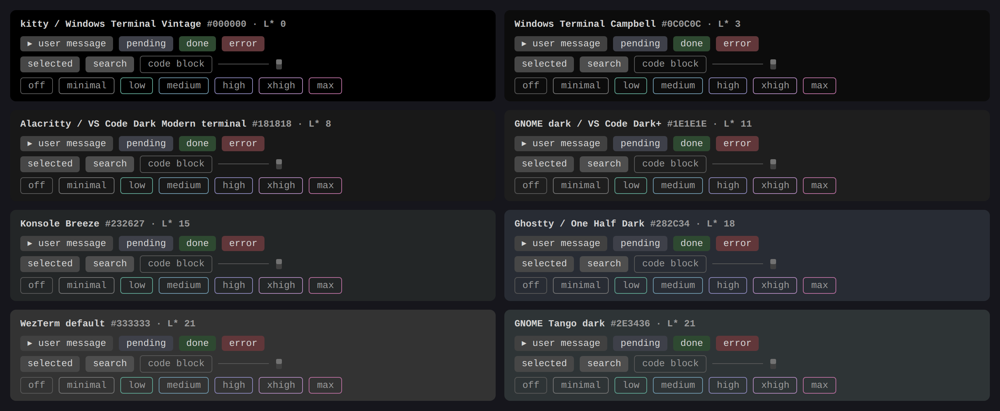

# 设计原则：背景承载状态，前景承载个性

> English: [design.en.md](design.en.md) · 返回 [README](../README.md)

下文用三种度量，含义如下：

- **对比度 `N:1`**：WCAG 相对亮度对比，前景相对背景的明暗比。1:1 是同色；3:1 是 UI 元素和大字的最低可读线；
  4.5:1 是正文的可读线；7:1 起算高对比。本集的判据：正文 ≥ 4.5，其余可读元素 ≥ 3。
- **CIE L\***：感知亮度，0 = 纯黑，100 = 纯白，刻度按人眼线性。两块底色的 ΔL\* 差 5 左右才能稳定分辨出"这是一块面板"。
- **ΔE**：两种颜色在感知上的总差异（亮度 + 色相 + 饱和）。约 2 是刚能察觉，10 以上一眼可分，20 以上是明显不同的颜色。

本文所有数字都能用 `python3 build_themes.py --measure` 重新算出；给它几个 hex 则输出两两之间的对比度 / ΔE / ΔL\*。

pi 没有全局背景 token，画布就是终端自己的背景色，主题只能决定画在其上的东西。
上游调色板一般只定义十几个颜色和编辑器角色，而 pi 有 56 个 token，其中 19 个是编辑器里不存在的
UI 面：用户消息盒、三种工具状态盒、选中、搜索、分隔线、滚动条、thinking 七档边框。

## UI 层：25 套共用一组常量

这 19 个 token 在 25 套主题里完全相同，与 pi 内置 dark 的架构一致——背景只表达状态，不表达主题身份。

| 元素 | 色值 | CIE L\* |
|---|---|---|
| 用户消息盒、自定义消息盒 | `#414141` | 27.5 |
| 工具执行中 | `#3E4049`（微冷灰，与用户盒 ΔE 6：能察觉、不抢眼） | 27.2 |
| 工具成功 / 失败 | `#2E4931` / `#61373A` | 28.3（与用户盒 ΔE 20 / 20，两者之间 36：一眼可分） |
| 选中 / 搜索高亮 | `#474747` / `#4E4E4E` | 30 / 33 |
| 分隔线、代码块边框、thinking off | `#575757` | 37 |
| 滚动块、thinking minimal | `#727272` | 48 |
| thinking low → max | `#5EA190` `#6E96AA` `#8985B7` `#AB85B7` `#B66D9D` | 青→蓝→蓝紫→紫→洋红 |

亮度取值来自主流终端**默认底色**的实测（各终端源码里的默认值）：

| 终端 / 方案 | 底色 | L\* |
|---|---|---|
| kitty、Windows Terminal Vintage / Ottosson | `#000000` | 0 |
| Windows Terminal Campbell | `#0C0C0C` | 3 |
| Alacritty 默认、VS Code Dark Modern 终端面板 | `#181818` | 8 |
| GNOME dark、VS Code Dark+ | `#1E1E1E` | 11 |
| Konsole Breeze | `#232627` | 15 |
| Ghostty 默认、One Half Dark | `#282C34` | 18 |
| WezTerm 默认、GNOME Tango dark | `#333333` / `#2E3436` | 21 |
| 本集 25 套配色自身的画布 | Rosé Pine `#191724` … Catppuccin Frappé `#303446` | 8.5–22.0 |

暗色终端底色几乎都落在 L\* 0–22。面板钉在 27.5，在本集最亮的画布（Catppuccin Frappé `#303446`，L\* 22.0）上仍比底色亮
5.5 个 L\*（刚好过"能分辨出面板"的线），在纯黑上亮 27.5（与 pi 内置 dark 在黑底上的量级相当）。底色比 L\* 22 更亮的终端
不在设计范围内。
下图是这一层画在每种底色上的实际效果（`--preview` 生成）：

thinking 等级的边框颜色只表示等级，五档五色、低刺激、不用红黄这类警报色，也不随主题变化。

## 前景层对终端底色的支持范围

前景是官方色，画布却是终端自己的底色，所以每套主题能在多亮的底色上保持可读各不相同。
`--check` 对上表每种底色重算全部画布前景，报告"最亮还能全过 3:1 / 4.5:1 的底色"（已列入已知代价的注释色除外）；
底色比这更亮时，最先失守的是该主题的 dim / 边框 / 注释一类次要前景，正文不受影响。

| 可用到的最亮底色 | 主题 |
|---|---|
| L\* 21–22（WezTerm `#333333`、GNOME Tango、各自画布） | One Dark Pro、Nord、Tokyo Night、Catppuccin Frappé / Macchiato、Everforest、Miramare、Moonlight、Oceanic Next、Synthwave '84、Material |
| L\* 18（Ghostty `#282C34`、One Half Dark） | Gruvbox、Solarized、ayu Mirage、Melange、Noctis Bordo / Sereno、Snazzy、Dracula（自身画布 17.3） |
| L\* 15–16（Konsole Breeze `#232627`） | Catppuccin Mocha、Kanagawa、Monokai、GitHub Dark、Andromeda |
| L\* 11（GNOME dark、VS Code Dark+ `#1E1E1E`） | Rosé Pine（pine 关键字与 muted 灰在更亮的底上跌破 3:1） |

## 前景层：以官方色为主

其余 37 个 token（正文 / 次要 / 状态行、语法、markdown、状态色、accent、边框）原则上只取官方调色板的色值，
角色按原作者的高亮定义映射，来源见 `build_themes.py` 每套主题头部的注释。唯一的自定义前景是 Solarized
工具标题 `#B3BAB3`：其官方 base1 在共享成功盒上只有 3.72:1，而下一档 base2 跳到 8.11:1；中间色取 5.01:1。

坚持官方色的已知代价（`--check` 会列出，有意不修）：

- 注释与状态行在 One Dark / Nord / Tokyo Night / Solarized / Miramare / Oceanic Next / Material
  只有 2.2–3.0:1，低于 3:1 的可读线——原作者本来就把注释做得暗，这是这些配色的样子。
- 一些官方红色在工具盒的深色底上偏暗：Nord / Solarized / Monokai / Gruvbox / Andromeda / Noctis
  的 diff 删除色 2.1–3.0:1，Solarized 的 violet 标签 2.3:1，Kanagawa 的 oniViolet 标签与
  autumnGreen 2.9:1，都略低于 3:1。
- 正文在画布上都过了 4.5:1 的可读线，但两套没到 7:1 的高对比：One Dark 6.6:1，Solarized（base1）5.6:1。
  在共享面板 / 选中底上有例外：Solarized 的 base1 在用户消息盒上 3.8:1、在选中底上 3.5:1，One Dark 的正文在选中底上
  4.4:1——这些灰底比画布亮，官方正文色没有更亮的一档可换。
- Dracula 的工具标题用官方 pink，在共享成功盒上 4.16:1，略低于 4.5:1 的正文线；粗体命令文字仍清晰。
- 文字层次：Dracula 官方只有 comment 一个灰，muted 与 dim 同色，三级文字只剩两级；One Dark 与 Solarized
  的正文与次要文字只差 ΔL\* 5 左右（官方 fg 与 statusFg / base1 与 base0 本就相近）。
- Synthwave '84 的正文是官方 `colors.foreground` 纯白 `#FFFFFF`（上游没有 editor.foreground），是全集最亮的正文。

有意的角色或色值偏离（都仍是该主题的官方色，只是角色与上游不同；2026-09-19 逐 hex 对照上游复核）：

- **可读性驱动**：Nord 正文用 nord6、次要用 nord4（pi 需要三级文字层次，Nord 没有中间灰）；Solarized 正文用
  base1（base0 在终端里太暗），工具标题使用上述中间色；Kanagawa diff 删除用 waveRed（autumnRed 在盒内只有
  2.1:1），边框用 ui.special 的 springViolet1（上游分隔线是背景色）；One Dark 面板内文字用其亮前景 `#D7DAE0`；
  Miramare 的次要文字、引用与边框用 orange（官方 Grey `#444444` 在终端画布上不可读，上游也没有次要文字层）；
  Noctis 的盒内次要文字用官方 TEXT（comment 在盒内只有 2.3:1）；Oceanic Next 的次要文字用官方扩展调色板的
  `#A7ADBA`；Material 的边框与工具标题用 base04（base03 是注释色太暗，base05 `#EEFFFF` 作标题刺眼，base0D 在盒内
  4.32:1）；Monokai 工具标题用官方 `editorLineNumber.activeForeground` `#C2C2BF`（fg `#F8F8F2` 作标题刺眼，
  accent 绿会和成功盒同色）；Catppuccin Frappé / Macchiato 的链接 URL 用 overlay1（Mocha 用的 overlay0 在这两个
  较亮画布上 2.9:1）；Tokyo Night diff 删除用 red（上游 diff 前景 git.delete `#914C54` 在盒内太暗）；Andromeda 标签
  用 blue（pink 在面板上 2.84:1）。
- **pi 没有对应角色，取同主题的相近官方角色**：Catppuccin 三套标题用 lavender、列表符用 mauve（上游 blue / teal）；
  Andromeda 列表符用 cyan（上游 yellow）；Synthwave '84 链接文字 / URL 与上游对调（green / yellow，让 URL 是较安静的
  一色），warning 用 yellow（上游 editorWarning 就是 success 的绿）；One Dark Pro 运算符用 cyan（上游只有逻辑 /
  算术运算符是 cyan，泛用 keyword.operator 是 fg）；Oceanic Next 标点用 fg（上游 teal）；Melange / Miramare 的 diff
  前景取自官方 b/c 色阶（上游的 diff 是背景色块，pi 的 diff 是共享盒内的前景文字）。
- **上游本身有版本差**：ayu Mirage 跟随 `ayu-colors` 仓库 HEAD 的 `mirage.yaml`（npm 发布的 ayu 8.0.1 仍是旧值，
  如函数色 `#FFD173`）；Solarized 的 green 取规范值 `#859900`（vim 文件里启用的是"实验"绿 `#719E07`）；Andromeda
  注释去掉了上游的 `cc` 透明度。
